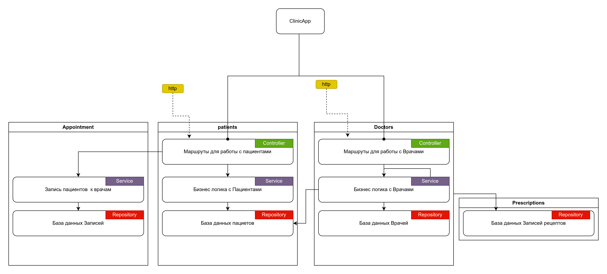
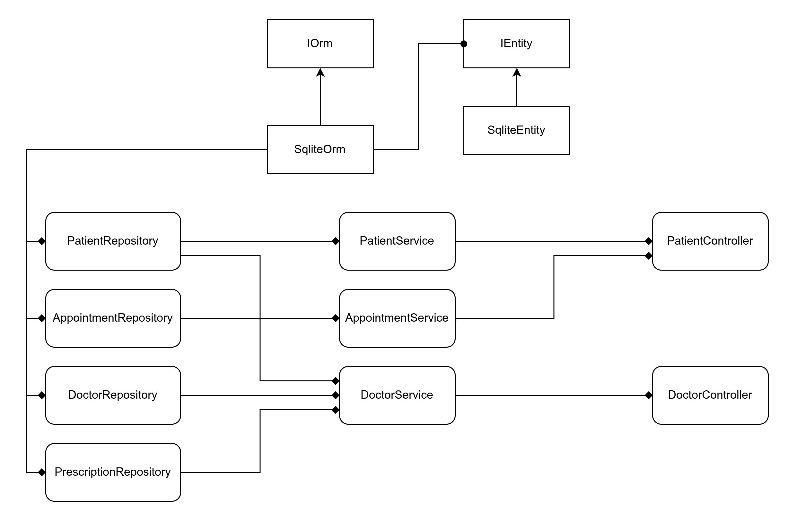

# Health Clinic Management Application

## 1. INTRODUCTION:
   This health clinic management application is automated and utilizes the Crow package for handling http requests, as well as sqlite3 for data management. It includes a register function for patients and doctors, using patient_id/doctor_id/Controllers. Additionally, users can schedule appointments with a necessary doctors, and doctors can record patients' medical histories. All of this data can be retrieved by sending a GET request. The application is developed in C++ using Windows OS, and Linux operating systems. However, for advanced functionality of application, it has been developed with the server.

## 2. Installation and Running the Application
	 Set up your enviroment: it could be 
cmd
Visual Studio Code.
Git.
NodeJS and npm.
Express.js.
React.

	Install and run Sqlite/MySQL for the work with the Database of Patients, Doctors and Treatment (Medical Issues and solving these deseases)
	Install and run Crow (C++ Framework - an easy-to-use framework for building HTTP or Websocket web services)

 ## 3. FEATURES

 # (1) Register patient        
http://localhost:18080/patient/register        
request method: POST        
request body:        
{    
    "patient_id": "Randomly UUID choice"
    "name": "String type of entering an information (A-Z)", 
    "age": "Int type of entered information (0-9) ",
    "gender": "Male/Female"
    "address": "String and int type of entering an information (A-Z/0-9) ",        
    "phone": "Int type of entered information (0-9)"     
    "medical_history": "String and int type of entering an information (A-Z/0-9),
    "count_visits": "Int type of entered information (0-9)"
}        

# (2) Retrieve patients        
http://localhost:18080/patient        
request method: GET

# (3) Register doctor        
http://localhost:18080/doctor/register       
request method: POST        
request body:        
{  
    "doctor_id": "Randomly UUID choice"
    "name": "String type of entering an information (A-Z)",        
    "specialization": "String type of entering an information (A-Z)",
    "address": "String and int type of entering an information (A-Z/0-9)"
    "phone": "Int type of entered information (0-9)"
}        

# (4) Retrieve doctors        
http://localhost:18080/doctor       
request method: GET

# (5) Make appointment        
http://localhost:18080/patient/appointment        
request method: POST        
request body:        
{        
    "patient_id": Randomly UUID choice,        
    "doctor_id": Randomly UUID choice,        
    "date":"DD-MM-YYYY",        
    "time": "7:00-19:00, only direct time(10.00/15.00, NOT 14.35)"        
}        

# (6) Retrieve appointments        
http://localhost:18080/appointment      
request method: GET 

# (7) Record medical history        
http://localhost:18080/patient/medical_history        
request method: POST             
request body:        
{    

"id", columnTypes::INT, true,
"patient_id", columnTypes::TEXT, false, true, "patients", "patient_ID",
"doctor_id", columnTypes::INT, false, true, "doctors", "id",
"prescription", columnTypes::TEXT,
"date", columnTypes::TEXT,
}        

# (8) Searching to retrieve patient`s medical history
http://localhost:18080/medical_history/ID     
request method: GET 

# (8) Retrieve medical history        
Medical history by patient_id cosists of Controller, searching by 1 feature (gender/age/id)
http://localhost:18080/medical_history                
request method: GET
{
"patient_id": Randomly UUID Choice
}

# (9) Implementing a procedure to record prescriptions associated with a patient ID
http://localhost:18080/doctor/prescribe       
request method: POST             
request body:        
{    
"patient_id", columnTypes::TEXT, false, true, "patients", "patient_ID",
"doctor_id", columnTypes::INT, false, true, "doctors", "id",
"prescription", columnTypes::TEXT
}        

# (10) Updating medical records after each patient visit

After each appointment count_visits becomes greater for 1 point
request body:
{
	"id", columnTypes::INT, true,
 	"name", columnTypes::TEXT,
        "age", columnTypes::INT,
        "gender", columnTypes::TEXT,
        "address", columnTypes::TEXT,
        "phone", columnTypes::TEXT,
        "medical_history", columnTypes::TEXT,
        "count_visits", columnTypes::INT,
        "patient_ID", columnTypes::TEXT
}
